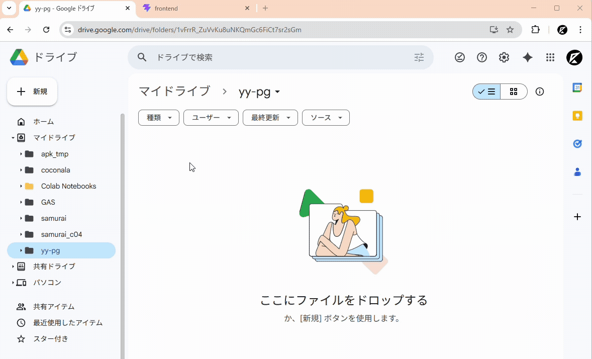
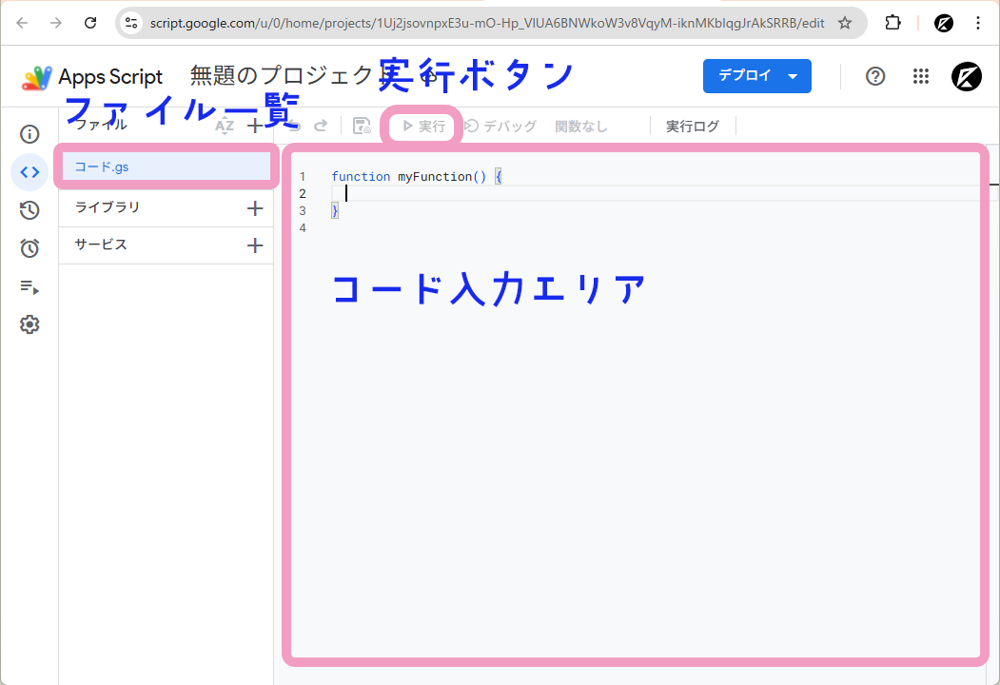
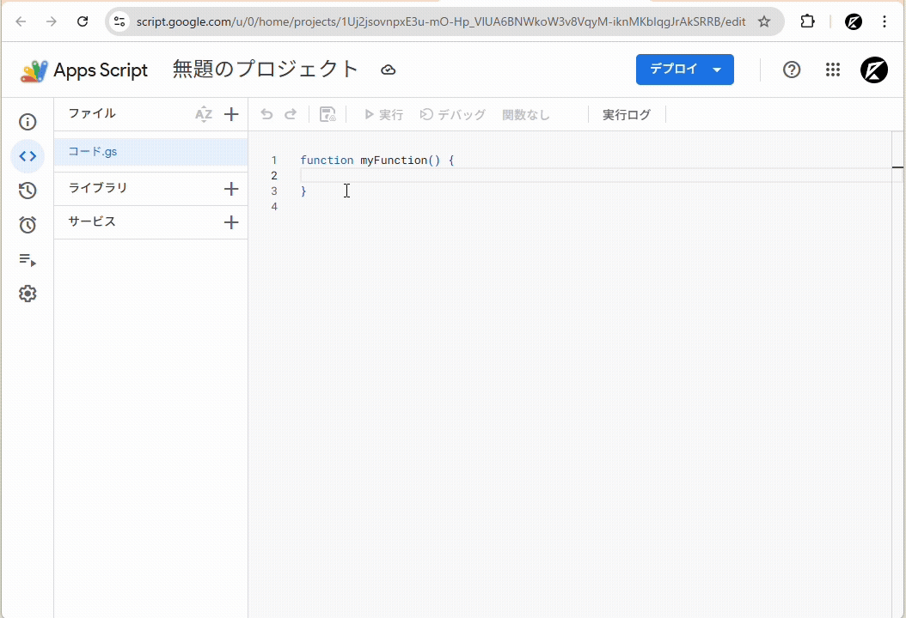
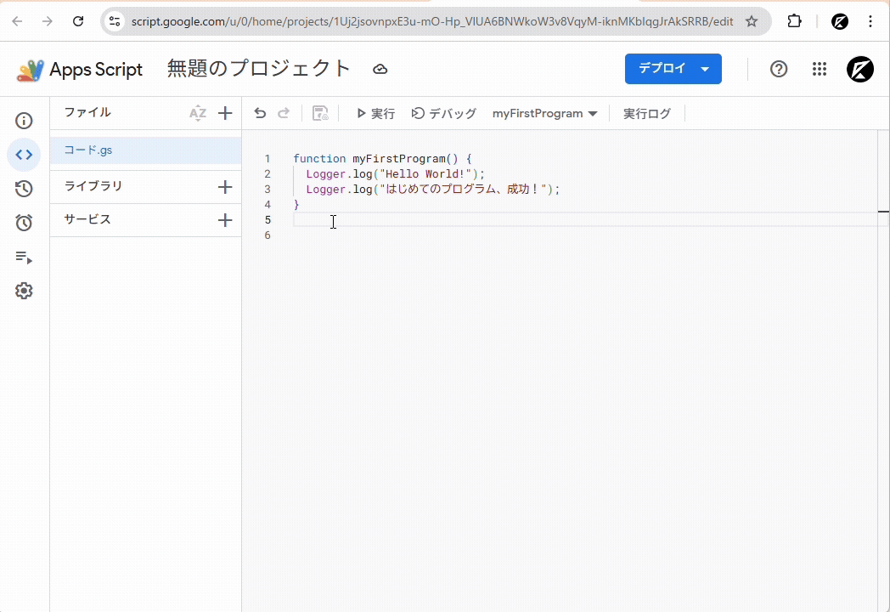

# ⚙️✨ Google Apps Script (GAS) をはじめよう！

> 〜 プログラミングの第一歩を GAS で踏み出そう 〜

---

## 📌 この教材でできるようになること

- ✅ GAS（Google Apps Script）とは何かを理解する
- ✅ GASのエディタを開いてプログラムを書く
- ✅ 変数・計算・文字列の基本を覚える
- ✅ if文（条件分岐）で処理を分ける
- ✅ for文（ループ）で繰り返し処理をする
- ✅ 関数を作って処理をまとめる
- ✅ スプレッドシートのデータを読み書きする

---

## 1️⃣ GASってなに？

GAS（ジーエーエス）は **Google Apps Script** の略です。
Googleが無料で提供しているプログラミング環境で、**JavaScript（ジャバスクリプト）** という言語を使います。

### 🌟 GASのすごいところ

| 特徴                | 説明                                                    |
| ------------------- | ------------------------------------------------------- |
| 💰 完全無料         | Googleアカウントがあれば誰でも使える                    |
| 🌐 インストール不要 | ブラウザだけで動く。アプリのダウンロードは不要！        |
| 📊 Googleと連携     | スプレッドシート・Gmail・カレンダーなどを自動操作できる |
| ☁️ クラウドで動く   | 自分のパソコンが電源オフでも、プログラムが動き続ける    |

### 🤔 プログラミングってむずかしい？

プログラミングは「コンピューターへのお手紙」です。
私たちが日本語で人に指示を出すように、プログラミング言語を使ってコンピューターに指示を出します。

```
人への指示：「スプレッドシートのA1セルに『こんにちは』と書いてね」

GASへの指示：
SpreadsheetApp.getActiveSheet().getRange('A1').setValue('こんにちは');
```

最初はむずかしく見えるけど、1つずつ覚えていけば大丈夫！

---

## 2️⃣ GASエディタを開いてみよう！

GASを書く場所（エディタ）を開く方法は2つあります。

### 方法① スプレッドシートから開く（おすすめ！）

| ステップ | やること                                         |
| -------- | ------------------------------------------------ |
| STEP 1   | Googleドライブで「新しいスプレッドシート」を作る |
| STEP 2   | メニューの「拡張機能」をクリック                 |
| STEP 3   | 「Apps Script」をクリック                        |
| STEP 4   | GASエディタが新しいタブで開く！                  |



### 方法② 直接GASのサイトを開く

https://script.google.com にアクセスして、「新しいプロジェクト」をクリック。

### 📝 エディタの画面構成

ファイル一覧に「Code.gs」というファイルが最初からあります。

ここにプログラムを書いていきます。

コード入力エリアの上には、ファイルを保存する「💾」ボタンと、プログラムを実行する「▶」ボタンがあります。



---

## 3️⃣ はじめてのプログラムを書こう！

### 🎯 まずは「Hello World!」

プログラミングの世界では、最初に「Hello World!」と表示するのがお決まりです！

```javascript
function myFirstProgram() {
  Logger.log("Hello World!");
  Logger.log("はじめてのプログラム、成功！");
}
```

> **📖 読み方ガイド**
>
> - `function` → 「ファンクション」＝ 処理のかたまり（関数）を作るキーワード
> - `myFirstProgram` → 関数の名前（自分で好きな名前をつけられる）
> - `Logger.log()` → カッコの中の文字をログ（実行結果）に表示する
> - `' '`（シングルクォート）→ 文字を囲むための記号

### ▶ 実行してみよう！

1. 上のコードをエディタに貼り付ける
2. ツールバーの「▶ 実行」ボタンをクリック
3. 初回は「権限の確認」が出るので「許可」をクリック
4. 下の「実行ログ」に結果が表示される！



---

## 4️⃣ 変数をおぼえよう！

### 📦 変数 ＝ データを入れる箱

変数は、データ（数字や文字）を一時的に保存しておく「箱」です。

```javascript
function learnVariables() {
  // 📦 変数を作る（letキーワードを使う）
  let name = "たろう"; // 文字を入れる
  let age = 12; // 数字を入れる
  let score = 85.5; // 小数も入れられる
  let isStudent = true; // true（はい）または false（いいえ）

  // 📋 中身を確認してみよう
  Logger.log("名前: " + name); // → 名前: たろう
  Logger.log("年齢: " + age + "歳"); // → 年齢: 12歳
  Logger.log("点数: " + score + "点"); // → 点数: 85.5点

  // 📦 中身を変えることもできる
  score = 92;
  Logger.log("再テスト: " + score + "点"); // → 再テスト: 92点

  // 🔒 constで作ると中身を変えられない（定数）
  const schoolName = "はんなり小学校";
  Logger.log("学校: " + schoolName);
  // schoolName = '別の学校';  ← これはエラーになる！
}
```

### 📊 データの種類（型）

| 種類   | 英語名  | 書き方の例      | 説明                         |
| ------ | ------- | --------------- | ---------------------------- |
| 文字列 | String  | `'こんにちは'`  | 文字のデータ。クォートで囲む |
| 数値   | Number  | `42`, `3.14`    | 数字のデータ。計算に使える   |
| 真偽値 | Boolean | `true`, `false` | 「はい」か「いいえ」の2択    |

このプログラムの実行例を見ると、変数にデータを入れて、ログに表示しているのがわかりますね！



---

## 5️⃣ 計算してみよう！

### 🧮 四則演算

```javascript
function learnCalculation() {
  let a = 10;
  let b = 3;

  Logger.log(a + b); // 13  （足し算）
  Logger.log(a - b); // 7   （引き算）
  Logger.log(a * b); // 30  （かけ算）← ×の代わりに *（アスタリスク）を使う
  Logger.log(a / b); // 3.333...（割り算）← ÷の代わりに /（スラッシュ）を使う
  Logger.log(a % b); // 1   （余り）← 10 ÷ 3 = 3 あまり 1

  // 🎯 実用例：お小遣い計算
  let monthlyAllowance = 3000; // 月のお小遣い
  let spent = 1200; // 使った金額
  let remaining = monthlyAllowance - spent;

  Logger.log("残り: " + remaining + "円"); // → 残り: 1800円
}
```

### 📝 文字列をつなげる

```javascript
function joinStrings() {
  let firstName = "たろう";
  let lastName = "田中";

  // + で文字をつなげる
  let fullName = lastName + " " + firstName;
  Logger.log(fullName); // → 田中 たろう

  // テンプレートリテラル（バッククォート ` を使う便利な書き方）
  let age = 12;
  let message = `${fullName}さんは${age}歳です`;
  Logger.log(message); // → 田中 たろうさんは12歳です
}
```

---

## 6️⃣ 条件分岐（if文）を使おう！

### 🔀 if文 ＝ 「もし〇〇なら△△する」

```javascript
function learnIf() {
  let score = 75;

  // 基本のif文
  if (score >= 80) {
    Logger.log("よくできました！");
  } else if (score >= 60) {
    Logger.log("がんばりました！");
  } else {
    Logger.log("もっとがんばろう！");
  }
  // score=75 なので → 「がんばりました！」が表示される
}
```

### 📊 比較演算子一覧

| 演算子 | 意味       | 使い方の例          |
| ------ | ---------- | ------------------- |
| `===`  | 等しい     | `score === 100`     |
| `!==`  | 等しくない | `name !== 'ゲスト'` |
| `>`    | より大きい | `age > 12`          |
| `<`    | より小さい | `price < 500`       |
| `>=`   | 以上       | `score >= 80`       |
| `<=`   | 以下       | `count <= 10`       |

### 🎯 実践：テストの成績判定

```javascript
function gradeTest() {
  let japaneseScore = 85;
  let mathScore = 72;
  let scienceScore = 91;

  // 合計点を計算
  let total = japaneseScore + mathScore + scienceScore;
  let average = total / 3;

  Logger.log("合計: " + total + "点");
  Logger.log("平均: " + average.toFixed(1) + "点");

  // 平均点で判定
  if (average >= 90) {
    Logger.log("評価: ⭐⭐⭐ 最高！");
  } else if (average >= 80) {
    Logger.log("評価: ⭐⭐ すごい！");
  } else if (average >= 70) {
    Logger.log("評価: ⭐ がんばった！");
  } else {
    Logger.log("評価: もう少しがんばろう！");
  }
}
```

---

## 7️⃣ ループ（for文）で繰り返そう！

### 🔄 for文 ＝ 「同じ処理を何回もやる」

```javascript
function learnLoop() {
  // 1から5までの数字を表示する
  for (let i = 1; i <= 5; i++) {
    Logger.log(i + "回目のループ");
  }
  // → 1回目のループ
  // → 2回目のループ
  // → 3回目のループ
  // → 4回目のループ
  // → 5回目のループ
}
```

### 📖 for文の読み方

```
for (let i = 1; i <= 5; i++) {
      ↑           ↑       ↑
   開始値       条件     増やす
  「1から」  「5以下の間」 「1ずつ増やす」
}
```

### 🎯 実践：九九の表を作ろう！

```javascript
function multiplicationTable() {
  let dan = 7; // 7の段

  Logger.log("=== " + dan + "の段 ===");
  for (let i = 1; i <= 9; i++) {
    let answer = dan * i;
    Logger.log(dan + " × " + i + " = " + answer);
  }
}
```

### 📦 配列（はいれつ）とループ

配列は「データをまとめて入れる箱」です。

```javascript
function learnArray() {
  // 配列を作る
  let fruits = ["りんご", "みかん", "バナナ", "ぶどう", "もも"];

  // 配列の中身を1つずつ取り出す
  for (let i = 0; i < fruits.length; i++) {
    Logger.log(i + 1 + "番目: " + fruits[i]);
  }
  // → 1番目: りんご
  // → 2番目: みかん
  // → 3番目: バナナ
  // → 4番目: ぶどう
  // → 5番目: もも

  // 配列の便利な操作
  Logger.log("全部で " + fruits.length + "個"); // 個数を調べる
  fruits.push("いちご"); // 最後に追加
  Logger.log("追加後: " + fruits.length + "個"); // → 6個
}
```

---

## 8️⃣ 関数を作ってみよう！

### 🧩 関数 ＝ 処理をまとめて名前をつけたもの

```javascript
// 🧩 あいさつ関数を作る
function greet(name) {
  return "こんにちは、" + name + "さん！";
}

// 🧩 合計を計算する関数
function calcTotal(a, b, c) {
  return a + b + c;
}

// 🧩 成績を判定する関数
function getGrade(score) {
  if (score >= 90) return "秀";
  if (score >= 80) return "優";
  if (score >= 70) return "良";
  if (score >= 60) return "可";
  return "不可";
}

// 🎯 関数を使ってみよう！
function useFunctions() {
  // greet関数を呼び出す
  Logger.log(greet("たろう")); // → こんにちは、たろうさん！
  Logger.log(greet("はなこ")); // → こんにちは、はなこさん！

  // calcTotal関数を呼び出す
  let total = calcTotal(85, 72, 91);
  Logger.log("合計: " + total + "点"); // → 合計: 248点

  // getGrade関数を呼び出す
  Logger.log("85点 → " + getGrade(85)); // → 85点 → 優
  Logger.log("55点 → " + getGrade(55)); // → 55点 → 不可
}
```

> **💡 関数を作るメリット**
>
> - 同じ処理を何度も書かなくていい（コードが短くなる）
> - 名前をつけるので、何をしているか分かりやすい
> - 一箇所直せば全部に反映される（修正がラク）

---

## 9️⃣ スプレッドシートを操作しよう！

ここからがGASの本領発揮！スプレッドシートをプログラムで操作します。

### 📖 基本のメソッド一覧

| コード                            | 意味                                   |
| --------------------------------- | -------------------------------------- |
| `SpreadsheetApp.getActiveSheet()` | 今開いているシートを取得               |
| `sheet.getRange('A1')`            | A1セルを指定                           |
| `sheet.getRange(行, 列)`          | 行番号・列番号で指定（例：1行目2列目） |
| `.getValue()`                     | セルの値を読み取る                     |
| `.setValue(値)`                   | セルに値を書き込む                     |
| `.getLastRow()`                   | データが入っている最後の行番号         |

### 💻 セルに書き込んでみよう

```javascript
function writeToSheet() {
  let sheet = SpreadsheetApp.getActiveSheet();

  // A1セルに文字を書き込む
  sheet.getRange("A1").setValue("名前");
  sheet.getRange("B1").setValue("点数");
  sheet.getRange("C1").setValue("判定");

  // 2行目にデータを書き込む
  sheet.getRange("A2").setValue("たろう");
  sheet.getRange("B2").setValue(85);
  sheet.getRange("C2").setValue("優");

  // 3行目にデータを書き込む
  sheet.getRange("A3").setValue("はなこ");
  sheet.getRange("B3").setValue(92);
  sheet.getRange("C3").setValue("秀");

  Logger.log("スプレッドシートへの書き込み完了！");
}
```

### 💻 セルから読み取ってみよう

```javascript
function readFromSheet() {
  let sheet = SpreadsheetApp.getActiveSheet();

  // A2セルの値を読み取る
  let name = sheet.getRange("A2").getValue();
  let score = sheet.getRange("B2").getValue();

  Logger.log(name + "さんの点数: " + score + "点");

  // 最終行まで全部読み取る
  let lastRow = sheet.getLastRow();
  Logger.log("データは" + lastRow + "行目まであります");

  for (let row = 2; row <= lastRow; row++) {
    let n = sheet.getRange(row, 1).getValue(); // A列
    let s = sheet.getRange(row, 2).getValue(); // B列
    Logger.log(n + ": " + s + "点");
  }
}
```

### 🎯 実践：成績表を自動で作ろう！

```javascript
function createScoreSheet() {
  let sheet = SpreadsheetApp.getActiveSheet();

  // 生徒のデータ（名前と3教科の点数）
  let students = [
    ["田中 たろう", 85, 72, 91],
    ["山田 はなこ", 92, 88, 95],
    ["佐藤 けんじ", 68, 75, 80],
    ["鈴木 みか", 78, 94, 86],
  ];

  // ヘッダーを書き込む
  sheet.getRange("A1").setValue("名前");
  sheet.getRange("B1").setValue("国語");
  sheet.getRange("C1").setValue("算数");
  sheet.getRange("D1").setValue("理科");
  sheet.getRange("E1").setValue("合計");
  sheet.getRange("F1").setValue("平均");
  sheet.getRange("G1").setValue("判定");

  // 各生徒のデータを書き込む
  for (let i = 0; i < students.length; i++) {
    let row = i + 2; // 2行目から書き込む
    let student = students[i];
    let name = student[0];
    let jpn = student[1];
    let math = student[2];
    let sci = student[3];

    // 合計と平均を計算
    let total = jpn + math + sci;
    let average = total / 3;

    // 判定を取得
    let grade = getGrade(Math.round(average));

    // スプレッドシートに書き込む
    sheet.getRange(row, 1).setValue(name);
    sheet.getRange(row, 2).setValue(jpn);
    sheet.getRange(row, 3).setValue(math);
    sheet.getRange(row, 4).setValue(sci);
    sheet.getRange(row, 5).setValue(total);
    sheet.getRange(row, 6).setValue(average.toFixed(1));
    sheet.getRange(row, 7).setValue(grade);
  }

  // クラス全体の集計
  let totalRow = students.length + 3;
  sheet.getRange(totalRow, 1).setValue("--- クラス集計 ---");

  let classTotal = 0;
  for (let i = 0; i < students.length; i++) {
    let row = i + 2;
    classTotal += sheet.getRange(row, 5).getValue();
  }
  let classAverage = classTotal / students.length;

  sheet.getRange(totalRow + 1, 1).setValue("クラス平均");
  sheet.getRange(totalRow + 1, 5).setValue(Math.round(classAverage));

  Logger.log("成績表の作成完了！");
}

// 判定用の関数（上で作ったものを再利用）
function getGrade(score) {
  if (score >= 90) return "秀";
  if (score >= 80) return "優";
  if (score >= 70) return "良";
  if (score >= 60) return "可";
  return "不可";
}
```

---

## 🔟 チャレンジ課題！ 🚀

### 🎯 課題1：自己紹介プログラム

自分の名前・年齢・趣味を変数に入れて、自己紹介文をログに表示しよう！

> **ヒント：** `let name = '自分の名前';` → `Logger.log()` で表示

### 🎯 課題2：買い物リスト

配列に5つの買い物アイテムと値段を入れて、合計金額を計算しよう！

> **ヒント：** `let prices = [120, 200, 350, 80, 150];` → for文で合計を計算

### 🎯 課題3：スプレッドシートに1週間の天気を記録

A列に曜日（月〜日）、B列に天気（晴れ・くもり・雨）を書き込むプログラムを作ろう！

> **ヒント：** 配列を2つ作って、for文でスプレッドシートに書き込む

### 🎯 課題4：点数入力＆自動判定

スプレッドシートのB列に点数を入力したら、C列に自動で判定（秀・優・良・可・不可）を書き込むプログラムを作ろう！

> **ヒント：** `getLastRow()` でデータの行数を調べて → for文で各行を処理 → `getGrade()` 関数を使う

---

## 📚 ここまでのまとめ

| 学んだこと | ポイント                                                 |
| ---------- | -------------------------------------------------------- |
| GASとは    | Googleサービスを自動化できる無料のプログラミング環境     |
| 変数       | `let` で作る。データを入れる箱。`const` は変えられない箱 |
| 計算       | `+` `-` `*` `/` `%` で計算できる                         |
| 条件分岐   | `if` `else if` `else` で処理を分ける                     |
| ループ     | `for` 文で同じ処理を繰り返す                             |
| 配列       | `[値1, 値2, ...]` で複数のデータをまとめる               |
| 関数       | `function 名前() {}` で処理をまとめて名前をつける        |
| シート操作 | `getRange()` `getValue()` `setValue()` でセルを読み書き  |

---

> 🎉 **次のステップ**
>
> GASの基本をマスターしたら、次はこんなことに挑戦してみよう！
>
> - 📊 スプレッドシートのデータを自動で集計・分析する
> - 📧 分析結果をGmailで自動送信する
> - 📱 LINEボットを作ってみる
>
> 基本がしっかり分かっていれば、どんなプログラムも作れるようになります 💪

---

_📝 はんなりdev 制作_
